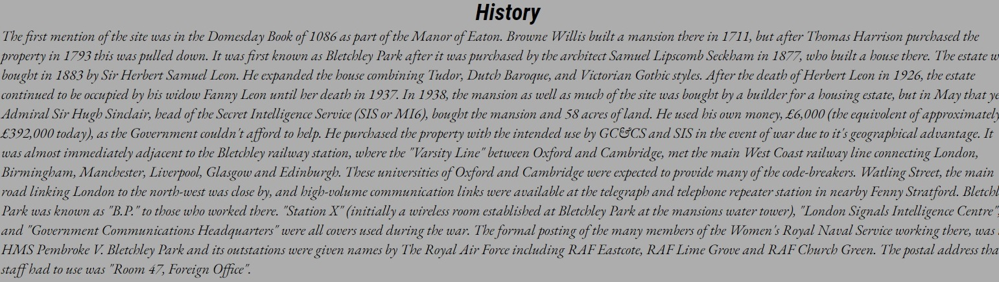
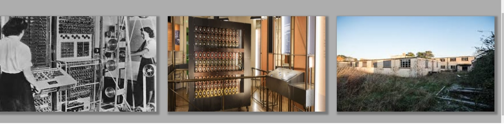
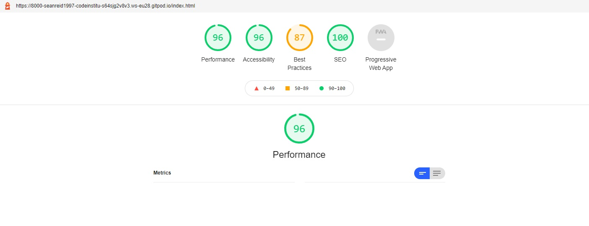

# Bletchley Park Wiki
Welcome, this website is designed for those who would like an idea of what Bletchley Park is and give the viewers a basic understanding of it's history and attractions. A place for those who are inquisitive about one of the many historical landmarks in Buckinghamshire which havde made enormous contributions during WW2 a crucial time in British history.

## Features

### Navigation

<ul><li>Located at the top of the page you will see links to three separate pages.</li>
<li>These pages will take you to the designated page that suits your interest. 
</li>
</ul>

 

### The Home Page

 
The <strong>Home</strong> page is where you will find information about Bletchley Park to get a grasp of what kind of place it is as well as where you will find it's location. It includes a picture of the stunning Bletchley Park Mansion.

 

### The History Page

 
The <strong>History</strong> page will give its viewer a brief but meaningful understanding of the history of Bletchley Park. On this page you wil also find out about the significant contributions that were made during the Second World War. 

 

### The Gallery Page

 
In the <strong>Gallery</strong> page you will see images of a few of the attractions that are located on the property. This page is made to give the viewers an idea of what to expect when visiting and places to visit. 

 

### Footer
 

<ul><li>Located at the bottom of each webpage there is footer.</li>
<li>Within the footer there are a few icons that serve as links to other websites.</li>
<li>Here you will find a links to social media as well as links for more info.</li> 

</ul>

## User Stories

### Targeted Audeience
 

<ul>
<li>Users who want learn about Bletchley Park.</li>
<li>Users who don't want to waste time looking through wikipedia to get a basiic understanding of Bletchley Park.</li>
<li>Users who want to know what kind of attractions they can expect to see.</li>
</ul>
 

##### As A First Time User:
<ul>
<li>I expect the website to be clutter-free and appealing</li>
<li>I expect to be able to navigate the site easily.</li>
<li>I want to be able to learn about Bletchley Park without having to waist time looking through complex websites like wikipedia.</li>
<li>I expect to learn about what makes Bletchley Park specail</li>
<li>I expect to be able to learn all about Bletchley Park's history.</li>
<li>I expect to be able to share my interest via social media.</li>
</ul> 

#### As A Returning User:
<ul>
<li>I want to be able to find information that I had previously seen without complications.</li>
<li>I expect the information to be relevant and up to date.</li>
<li>I expect to be able to give feedback.</li>
<li>I expect to be able to find out if, how and when I can visit.</li>
</ul>

## Testing

### Bugs

 

### Validation

 

<ul>
<li>HTML code was checked on the w3 html validator. No errors were found.</li>
<li>CSS code was checked on the w3 css validator. No errors were found</li>
<li>Performance, Accessibility and SEO were checked via lighthouse in devtools. 
</li>
</ul>

 

## Deployment

### Github Pages
 

<ul><li>The website was deployed to Github pages on 24/01/2022</li></ul>
 

## Credits

### Code Institute
 

<ul><li>The template used for this website was the CI template from Code Institute.
</li></ul>
 

### Content
 

<ul><li>The content for this website were from Wikipedia and were re-organised to be more appealing.</li>
<li>Icons for social media were used from The FontAwesome website.</li></ul>
 

 ### Media 
  

<ul><li>All images were taken from Google Images.</li></ul>