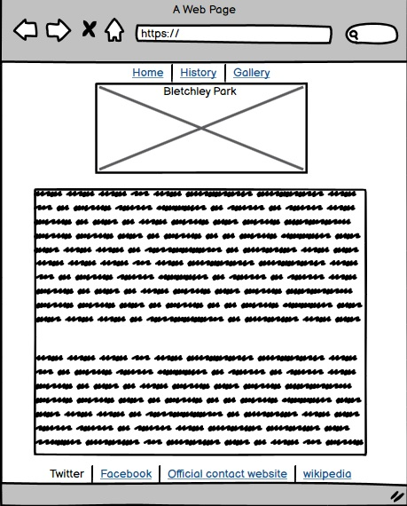

# Bletchley Park Wiki
(Developer: Sean Reid)

Welcome, this website is designed for those who would like an idea of what Bletchley Park is and give the viewers a basic understanding of it's history and attractions. A place for those who are inquisitive about one of the many historical landmarks in Buckinghamshire which havde made enormous contributions during WW2 a crucial time in British history.

<a href="https://seanreid1997.github.io/code-institute-p1" target="_blank">Launch Live Website</a>

## Table of Contents

1. [Project Goals](#project-goals)
    1. [User Goals](#user-goals)
    2. [Site Owner Goals](#site-owner-goals)
2. [User Experience](#user-experience)
    1. [Targeted Audience](#targeted-audience)
    2. [User Requirements and Expectations](#user-requirements-and-expectations)
    3. [User Stories](#user-stories)
3. [Design](#design)
    1. [Design Choices](#design-choices)
    2. [Colour](#colours)
    3. [Fonts](#fonts)
    4. [Structure](#structure)
    5. [Wireframes](#wireframes)
4. [Technologies Used](#technologies-used)
    1. [Languages](#languages)
    2. [Frameworks & Tools](#frameworks-&-tools)
5. [Features](#features)
6. [Testing](#validation)
    1. [HTML Validation](#HTML-validation)
    2. [CSS Validation](#CSS-validation)
    3. [Accessibility](#accessibility)
    4. [Performance](#performance)
    5. [Device testing](#performing-tests-on-various-devices)
    6. [Browser compatibility](#browser-compatability)
    7. [Testing user stories](#testing-user-stories)
8. [Bugs](#Bugs)
9. [Deployment](#deployment)
10. [Credits](#credits)
11. [Acknowledgements](#acknowledgements)

## Project Goals

### User Goals

<ul>
<li>To learn about Bletchley Park.</li>
<li>To learn about why Bletchley Park is such a famous historical figure.</li>
<li>To see a gallery of pictures so they can learn more visually.</li>
</ul>

### Site Owner Goals

<ul>
<li>To introduce users to Bletchley Park.</li>
<li>To be able to teach users about what makes Bletchley Park special.</li>
<li>To provide more information than the official website but also a less complex stucture than wikipedia.</li>
<li>To appeal to users to learn even more and hopefully plan a visit.</li>
</ul>

## User Experience

### Targeted Audience

<ul>
<li>Users who want learn about Bletchley Park.</li>
<li>Users who don't want to waste time looking through wikipedia to get a basiic understanding of Bletchley Park.</li>
<li>Users who want to know what kind of attractions they can expect to see.</li>
</ul>

### User Requirements and Expectations

<ul>
<li>Webpages that are easy to navigate.</li>
<li>Social media links to share their interests.</li>
<li>A place/link to be able to book a visit or contact Bletchley Park.</li>
<li>To have all links and pages working properly.</li>
<li>For contents to be easily understandable.</li>
</ul>

### User Stories

#### As A First Time User:

1. I expect the website to be clutter-free and appealing.
2. I expect to be able to navigate the site easily.
3. I want to be able to learn about Bletchley Park without having to waist time looking through complex websites like wikipedia.
4. I expect to learn about what makes Bletchley Park special.
5. I expect to be able to learn all about Bletchley Park's history.
6. I expect to be able to share my interest via social media.

#### As A Returning User:

7. I want to be able to find information that I had previously seen without complications.
8. I expect the information to be relevant and up to date.
9. I expect to be able to give feedback.
10. I expect to be able to find out if, how and when I can visit.

#### As A Site Owner:

11. I want users to be able to navigate through the site effortlessley.
12. I want users to be able to understand the information given regardless of age.
13. I want users to feel interested even a little when they leave.
14. I want users to be able to visually see a living part of history.
15. 

## Design

### Design Choices

### Color

### Fonts

### Structure

### Wireframes

Home

History

Gallery

## Technologies Used

### Languages

### Frameworks and Tools

## Features

### Navigation

<ul><li>Located at the top of the page you will see links to three separate pages.</li>
<li>These pages will take you to the designated page that suits your interest.
</li>
</ul>

### The Home Page

The <strong>Home</strong> page is where you will find information about Bletchley Park to get a grasp of what kind of place it is as well as where you will find it's location. It includes a picture of the stunning Bletchley Park Mansion.

### The History Page

 
The <strong>History</strong> page will give its viewer a brief but meaningful understanding of the history of Bletchley Park. On this page you wil also find out about the significant contributions that were made during the Second World War. 

### The Gallery Page

In the <strong>Gallery</strong> page you will see images of a few of the attractions that are located on the property. This page is made to give the viewers an idea of what to expect when visiting and places to visit. 

### Footer

<ul><li>Located at the bottom of each webpage there is footer.</li>
<li>Within the footer there are a few icons that serve as links to other websites.</li>
<li>Here you will find a links to social media as well as links for more info.</li>

</ul>

## Testing

### Running
<ul>
<li>Tested all hyperlinks and have confirmed that they all work as they should</li>
</ul>

### Responsiveness:
<ul>
<li>I have confirmed that the site is responsive.</li>
</ul>

### Bugs
<ul><li>Iframe for map shows the error "Google.com refused to connect".</li></ul>

### Validation

#### Html

### Css

### Accessablility

<li>CSS code was checked on the w3 css validator. No errors were found</li>
<li>Performance, Accessibility and SEO were checked via lighthouse in devtools. 
</li>
</ul>

## Deployment

### Github Pages

<ul><li>The website was deployed to Github pages on 25/01/2022</li></ul>

## Credits

### Code Institute

<ul><li>The template used for this website was the CI template from Code Institute.
</li></ul>

### Content

<ul><li>The content for this website were from Wikipedia and were re-organised to be more appealing.</li>
<li>Icons for social media were used from The FontAwesome website.</li>
<li>Everything was taken from my original draft <a href="https://github.com/seanreid1997/My-First-Project" target="_blank">seanreid1997/My-First-Project</a></li></ul>

 ### Media 
 

<ul><li>All images were taken from Google Images.</li></ul>