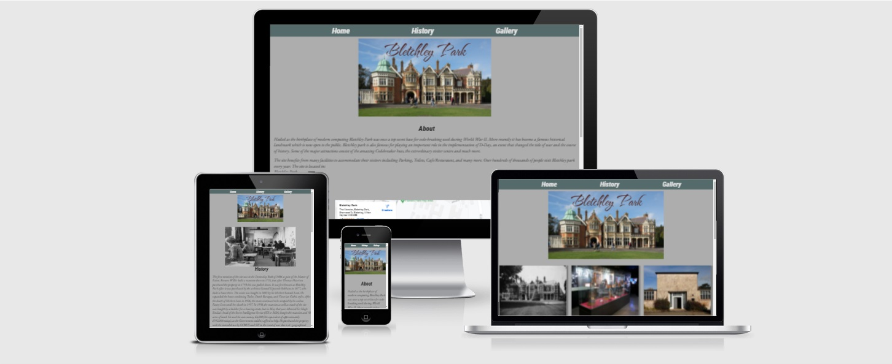

# Bletchley Park Wiki
(Developer: Sean Reid)

Welcome, this website is designed for those who would like an idea of what Bletchley Park is and give the viewers a basic understanding of it's history and attractions. A place for those who are inquisitive about one of the many historical landmarks in Buckinghamshire which havde made enormous contributions during WW2 a crucial time in British history.

<a href="https://seanreid1997.github.io/code-institute-p1" target="_blank">Launch Live Website</a>

## Table of Contents

1. [Project Goals](#project-goals)
    1. [User Goals](#user-goals)
    2. [Site Owner Goals](#site-owner-goals)
2. [User Experience](#user-experience)
    1. [Targeted Audience](#targeted-audience)
    2. [User Requirements and Expectations](#user-requirements-and-expectations)
    3. [User Stories](#user-stories)
3. [Design](#design)
    1. [Design Choices](#design-choices)
    2. [Colour](#colours)
    3. [Fonts](#fonts)
    4. [Structure](#structure)
    5. [Wireframes](#wireframes)
4. [Technologies Used](#technologies-used)
    1. [Languages](#languages)
    2. [Frameworks and Tools](#frameworks-and-tools)
5. [Features](#features)
6. [Testing](#validation)
7. [Bugs](#Bugs)
8. [Deployment](#deployment)
9. [Credits](#credits)
10. [Acknowledgements](#acknowledgements)

## Project Goals

### User Goals

<ul>
<li>To learn about Bletchley Park.</li>
<li>To understand why Bletchley Park is such a famous historical figure.</li>
<li>To see a gallery with images of different places there.</li>
</ul>

### Site Owner Goals

<ul>
<li>To introduce users to Bletchley Park.</li>
<li>To be able to teach users about the importance of Bletchley Park.</li>
<li>To provide more information in a less complex stucture than other sites.</li>
<li>To appeal to users to want learn more and hopefully plan a visit.</li>
<li>Pages should be responsive.</li>
<li>User should not have to use browser back on 404 page.</li>
</ul>

## User Experience

### Targeted Audience

<ul>
<li>Users who want learn about Bletchley Park.</li>
<li>Users who don't want to waste time looking through wikipedia to get a basiic understanding of Bletchley Park.</li>
<li>Users who want to know what kind of attractions they can expect to see.</li>
</ul>

### User Requirements and Expectations

<ul>
<li>Webpages that are easy to navigate.</li>
<li>Social media links to share their interests.</li>
<li>A place/link to be able to book a visit or contact Bletchley Park.</li>
<li>To have all links and pages working properly.</li>
<li>For contents to be easily understandable.</li>
</ul>

### User Stories

#### As A First Time User:

1. I expect the website to be clean and clutter-free.
2. I expect to be able to navigate the site easily.
3. I expect to learn about what makes Bletchley Park special.
4. I expect to be a locate Bletchley Park.
5. I expect to be able to contact Bletchley Park.
6. I expect to be able to learn all about Bletchley Park's history.
7. I expect to be able to share my interest via social media.

#### As A Returning User:

8. I want to be able to find information that I had previously seen without complications.
9. I expect the information to be relevant and up to date.
10. I expect to be able to review the map.
11. I expect to be able to find out if, how and when I can visit.

#### As A Site Owner:

12. I want users to be able to navigate through the site effortlessley.
13. I want users to be able to understand the information given regardless of age.
14. I want users to feel interested even a little when they leave.
15. I want users to be able to visually see a living part of history.

## Design

### Design Choices

The website was designed to be a simple website with a simple layout that can act as source of information for viewers.

### Color

### Fonts

All of the fonts for this project were taken from Google Fonts. The following fonts were used:
<ul>
<li>For the navigation bar and level 2 headings I used 'Roboto Condensed'.</li>
<li>For the level 1 heading, the text on the main image, I used 'The Nautigal'.</li>
<li>For the paragraphs I used 'EB Garamond'</li>
</ul>

### Structure

The Website has a very simple simple stucture. It consists of easy to understand navigation bar and a footer with all of the external links. The navigation bar contains the links to three pages:
<ul>
<li>A Home page with all the basic information about Bletchley Park.</li>
<li>A History page.</li>
<li>A gallery page with a number of images.</li>
</ul>

### Wireframes

Home

History

Gallery

## Technologies Used

### Languages

<ul>
<li>HTML</li>

<li>CSS</li></ul>

### Frameworks and Tools

<ul>
<li>Balsamiq</li>
<li>FontAwesome</li>
<li>Git</li>
<li>Github</li>
<li>Gitpod</li>
<li>Google Fonts</li>
<li>Windows Paint App</li>
</ul>

## Features

### Navigation

<ul><li>Located at the top of the page you will see links to three separate pages.</li>
<li>These pages will take you to the designated page that suits your interest.</li>

<li>User stories covered:</li>
</ul>

### The Home Page

<ul>
<li>The <strong>Home</strong> page contains an image of Bletchley Park Mansion.</li>
<li>It also give a description about Bletchley Park</li>

<li>User stories covered:</li>
</ul>

### Map

<ul>
<li>The home page consists of an embedded map.</li>

<li>User stories covered:</li>
</ul>

### The History Page

The <strong>History</strong> page will give its viewer a brief but meaningful understanding of the history of Bletchley Park. On this page you wil also find out about the significant contributions that were made during the Second World War.

<li>User stories covered:</li>

### The Gallery Page

In the <strong>Gallery</strong> page you will see images of a few of the attractions that are located on the property. This page is made to give the viewers an idea of what to expect when visiting and places to visit.

<li>User stories covered:</li>

### Footer

<ul><li>Located at the bottom of each webpage there is footer.</li>
<li>Within the footer there are a few icons that serve as links to other websites.</li>
<li>Here you will find a links to social media as well as links for more info.</li>

<li>User stories covered:</li>
</ul>

## Testing

### Validation

#### HTML

<ul>
<li>Html was validated via The WC3 Markup Validation Service.</li>
</ul>

Home

History

Gallery

### CSS

<ul>
<li>Css was validated via The WC3 CSS Validation Service.</li>
</ul>

Css

### Accessablility

Accessibility was tested via The Wave Web Accessibility Evaluation Tool

Home

History

Gallery

### Performance

Home

History

Gallery

### Device Testing

### Browser Compatibility

The website was tested on the browsers listed below:
<ul>
<li>Google Chrome</li>
<li>Microsoft Edge</li>
<li></li>
</ul>

### Testing User Stories

1. | **Feature** | **Action** | **Expected Result** | **Actual Result** |
|-------------|------------|---------------------|-------------------|
| News | Scroll down on home page and locate news section | Find latest news | Works as expected |

2. | **Feature** | **Action** | **Expected Result** | **Actual Result** |
|-------------|------------|---------------------|-------------------|
| News | Scroll down on home page and locate news section | Find latest news | Works as expected |

3. | **Feature** | **Action** | **Expected Result** | **Actual Result** |
|-------------|------------|---------------------|-------------------|
| News | Scroll down on home page and locate news section | Find latest news | Works as expected |

4. | **Feature** | **Action** | **Expected Result** | **Actual Result** |
|-------------|------------|---------------------|-------------------|
| News | Scroll down on home page and locate news section | Find latest news | Works as expected |

5. | **Feature** | **Action** | **Expected Result** | **Actual Result** |
|-------------|------------|---------------------|-------------------|
| News | Scroll down on home page and locate news section | Find latest news | Works as expected |

6. | **Feature** | **Action** | **Expected Result** | **Actual Result** |
|-------------|------------|---------------------|-------------------|
| News | Scroll down on home page and locate news section | Find latest news | Works as expected |

7. | **Feature** | **Action** | **Expected Result** | **Actual Result** |
|-------------|------------|---------------------|-------------------|
| News | Scroll down on home page and locate news section | Find latest news | Works as expected |

8. | **Feature** | **Action** | **Expected Result** | **Actual Result** |
|-------------|------------|---------------------|-------------------|
| News | Scroll down on home page and locate news section | Find latest news | Works as expected |

9. | **Feature** | **Action** | **Expected Result** | **Actual Result** |
|-------------|------------|---------------------|-------------------|
| News | Scroll down on home page and locate news section | Find latest news | Works as expected |

10. | **Feature** | **Action** | **Expected Result** | **Actual Result** |
|-------------|------------|---------------------|-------------------|
| News | Scroll down on home page and locate news section | Find latest news | Works as expected |

11. | **Feature** | **Action** | **Expected Result** | **Actual Result** |
|-------------|------------|---------------------|-------------------|
| News | Scroll down on home page and locate news section | Find latest news | Works as expected |

12. | **Feature** | **Action** | **Expected Result** | **Actual Result** |
|-------------|------------|---------------------|-------------------|
| News | Scroll down on home page and locate news section | Find latest news | Works as expected |

13. | **Feature** | **Action** | **Expected Result** | **Actual Result** |
|-------------|------------|---------------------|-------------------|
| News | Scroll down on home page and locate news section | Find latest news | Works as expected |

14. | **Feature** | **Action** | **Expected Result** | **Actual Result** |
|-------------|------------|---------------------|-------------------|
| News | Scroll down on home page and locate news section | Find latest news | Works as expected |

15. | **Feature** | **Action** | **Expected Result** | **Actual Result** |
|-------------|------------|---------------------|-------------------|
| News | Scroll down on home page and locate news section | Find latest news | Works as expected |

## Bugs

| **Bugs** | **Fixes** |
| -------- | --------- |
| The iframe for the map had an error of "google.com refused to connect". | Remove live map and replace with screenshot.
| Accessibilty validation revealed a contrast error with level 1 heading. | Change h1 to darker color.
| Html validation check revealed a warning to give nav section a heading. | Change section elements to divs.

## Deployment

### Github Pages

The site was deployed to GitHub Pages via the following steps:
<ul>
<li>Within the GitHub repository, navigate to the Settings tab.</li>
<li>In the menu on the left select Pages.</li>
<li>From the Source Branch menu seclect Main and save.</li>
<li>Once complete the page will provide a link to deployed website.</li>
<li>After a few minutes, refrsh the page and the site will be ready.</li>

</ul>

## Credits

### Code Institute

<ul>
<li>The template used for this website was the CI template from Code Institute.
</li>
<li>Code for footer icons was inspired by Love Runnig project.</li>
</ul>

### Content

<ul>
<li>The content for this website were from Wikipedia and were re-organised to be more appealing.</li>
<li>Icons for social media were used from The FontAwesome website.</li>
<li>Map was taken from https://www.embedgooglemap.net/</li>
<li>Everything was taken from my original draft <a href="https://github.com/seanreid1997/My-First-Project" target="_blank">seanreid1997/My-First-Project</a></li>
</ul>

 ### Media 
 
 <ul><li>All images were taken from Google Images.</li></ul>

 ## Acknowledgements

 <ul>
 <li>I would like t othank my mentor Mo Shami for his patience and advice during this project. I had started the project on the wrong foot but he brought it back in time for me to finish before the deadline.</li>
 <li>I would like to thank Developer Ana Runje, whos project README structure inspired my own.</li>
 <li>I would also like to thank the Stack Overflow community as well for help with a number of queries i had during this time</li>
 <li>And lastly I would like to thank the Code Institute student care team for the continued support.</li>
 </ul>